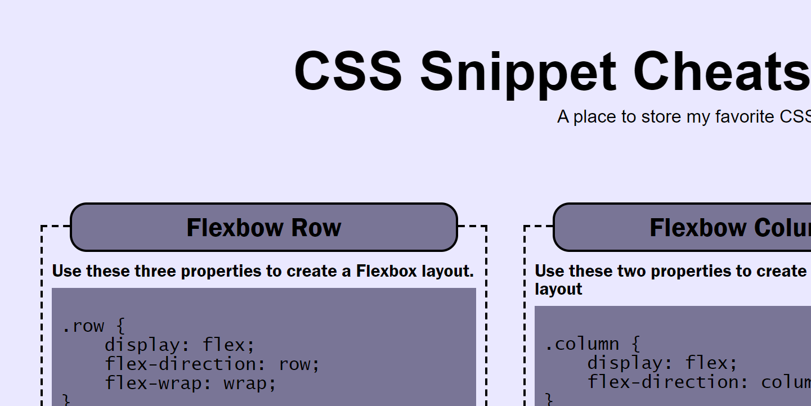
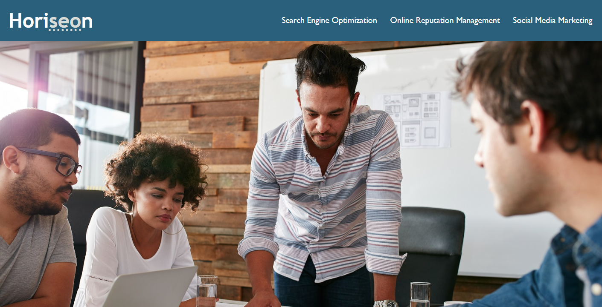

# best-portfolio

[Link to my project](https://github.com/Deiontre10/best-portfolio)

## Table of Contents
- [Description](#description)
- [Visuals](#visuals)

## Description
This is a portfolio for projects. It has a reset.css in case anything goes wrong with the style.css. Utilizes flex box and media screen.

## Visuals

